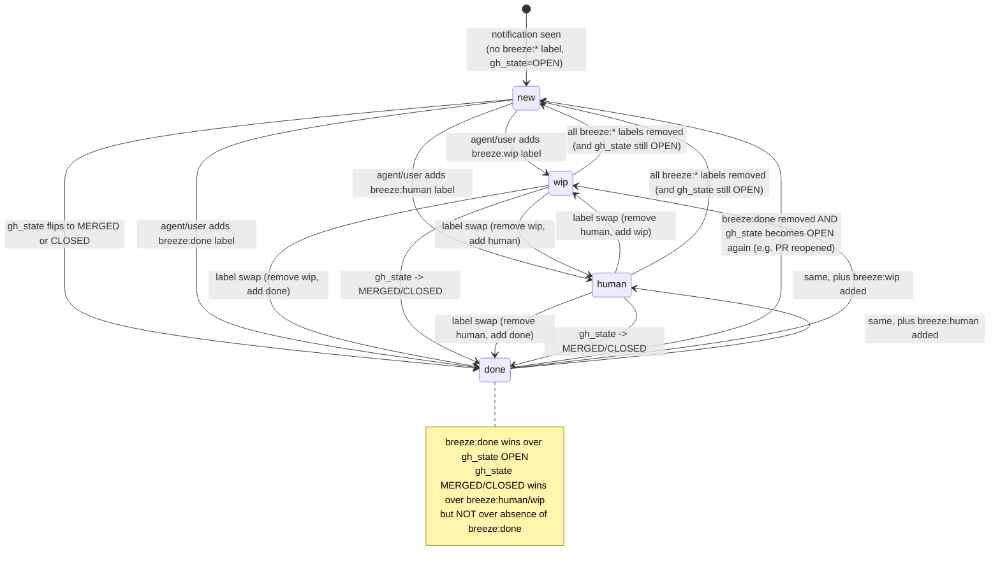

# 03 — Status State Machine

Source of truth:
- `first-tree-breeze/breeze-runner/src/classify.rs` (200 lines — **this is the
  `TaskKind` classifier for the dispatcher**; do not confuse with
  `breeze_status`)
- `first-tree-breeze/breeze-runner/src/fetcher.rs:353-368` —
  `compute_breeze_status` (the real derivation rule)
- `first-tree-breeze/bin/breeze-status-manager` (266 lines — label write path)
- `first-tree-breeze/breeze-runner/src/runner.rs:206-219` — the prompt
  instructing agents to set labels themselves
- GitHub labels `breeze:new`, `breeze:wip`, `breeze:human`, `breeze:done`

There are two separate state concepts in breeze. Don't conflate them:

1. **`breeze_status`** — the label-derived per-notification status that drives
   the dashboard, statusline, and `/breeze` skill. Values: `new | wip | human | done`.
2. **`TaskKind` + dispatcher priority** — how the runner scheduler classifies
   and prioritizes a candidate before dispatching an agent (see doc #4). Not a
   state machine.

This doc covers (1). (2) is referenced only where it interacts with labels.

## 1. State diagram



The transitions observable in `activity.log` are a subset of these: see §5.

## 2. Derivation rule (`compute_breeze_status`, `fetcher.rs:353-368`)

The canonical rule. Inputs per notification: `gh_state: Option<&str>` from the
GraphQL enrichment (`OPEN | CLOSED | MERGED | null`) and `labels: &[String]`
from the same enrichment.

Precedence (top wins):

1. **`labels` contains `breeze:done`** → `"done"`
2. **`gh_state ∈ {"MERGED", "CLOSED"}`** → `"done"`
3. **`labels` contains `breeze:human`** → `"human"`
4. **`labels` contains `breeze:wip`** → `"wip"`
5. otherwise → `"new"`

Implementation:

```rust
// fetcher.rs:353-368
pub fn compute_breeze_status(gh_state: Option<&str>, labels: &[String]) -> &'static str {
    let has = |needle: &str| labels.iter().any(|label| label == needle);
    if has("breeze:done") { return "done"; }
    if matches!(gh_state, Some("MERGED") | Some("CLOSED")) { return "done"; }
    if has("breeze:human") { return "human"; }
    if has("breeze:wip") { return "wip"; }
    "new"
}
```

Covered by tests at `fetcher.rs:796-822` including the "done beats
human+wip" case and the "OPEN + no label = new" default.

Important subtleties:

- **`breeze:new` is not part of the derivation.** The bash status-manager sets
  `breeze:new` as an optional explicit marker (`breeze-status-manager:115-118`
  and `breeze-status-manager:247`), but the Rust derivation ignores it. The
  labels created via `ensure-labels` include `breeze:new` purely for human
  readability; absence of `breeze:*` labels is the real "new" signal.
- **Labels are fetched via one `first: 10` GraphQL call per PR/issue** batched
  by repo (`fetcher.rs:209-254`). If a PR has more than 10 labels and
  `breeze:*` is off the end, derivation may be wrong. Unverified whether any
  real repo exceeds this.
- **`gh_state` is only populated for `Issue` or `PullRequest` subjects**
  (`fetcher.rs:167-175`). Discussions, Releases, etc. always get `gh_state =
  null` and therefore get the label-only path. An un-closable Discussion with
  no labels will remain `new` forever.

## 3. Label write path (`bin/breeze-status-manager set`)

When a user or agent asks the status-manager to change state:

```
breeze-status-manager set <notification-id> <new-status> [--by <session>] [--reason <text>]
```

Steps (`breeze-status-manager:76-170`):

1. Look up `repo` and `number` for the notification id from `inbox.json` via
   `jq` (`breeze-status-manager:90`). Fail if missing.
2. **Always** first remove every `breeze:*` label via per-label calls
   (`breeze-status-manager:98-103`). The per-label loop exists because
   `gh ... --remove-label 'a,b,c'` errors if any one label doesn't exist on
   the item:
   ```
   for lbl in breeze:new breeze:wip breeze:human breeze:done; do
     gh issue edit "$num" --repo "$repo" --remove-label "$lbl" 2>/dev/null || true
   done
   ```
   (All `2>/dev/null || true` — failures are swallowed silently.)
3. Based on `new-status` (`breeze-status-manager:115-135`):
   - `new` → only the removal; no add.
   - `wip` → add `breeze:wip` (color `e4e669`, desc "Breeze: work in progress")
   - `human` → add `breeze:human` (color `d93f0b`, desc "Breeze: needs human attention")
   - `done` → add `breeze:done` (color `0e8a16`, desc "Breeze: handled")
4. Adding a label falls back to creating it first if the repo doesn't have it
   (`breeze-status-manager:106-112`):
   ```
   gh issue edit ... --add-label "$label" 2>/dev/null || {
     gh label create "$label" --repo "$repo" --color "$color" --description "$desc" --force
     gh issue edit ... --add-label "$label"
   }
   ```
5. If the new status is not `wip`, remove the local claim directory
   (`breeze-status-manager:137-140`).
6. Optimistically patch `~/.breeze/inbox.json` in place via `jq` to set
   `breeze_status` to the new value (`breeze-status-manager:143-149`). This
   will be overwritten next poll but gives the statusline a fast-path update.
7. Append a `transition` event to `~/.breeze/activity.log` with the old
   status, new status, session id (`by`), and reason (`breeze-status-manager:151-168`).

Notes:

- All calls go through `gh issue edit` even for pull requests. This works
  because GitHub treats PRs as a kind of issue and the issue-labels API works
  on either. (Running it on a closed PR still succeeds for label ops.)
- There is no check that the local label change actually went through — all
  `gh` errors are swallowed with `|| true`. If the user lacks push rights the
  local `inbox.json` will be patched but the GitHub label will not move, and
  the NEXT poll will revert `breeze_status` to whatever GitHub actually shows.
  This is the silent "non-labeler fallback".
- `set` happens synchronously from the shell. It does NOT flow through the
  `GhExecutor` rate-limit machinery — so it can collide with the daemon's
  `gh` calls. In practice mutations to labels are cheap and rare enough that
  GitHub's secondary rate limit rarely triggers.

## 4. Agent-side self-labeling (runner prompt)

Every agent task is handed a prompt that includes explicit labeling
instructions (`runner.rs:206-214`):

```
Status labeling rule (REQUIRED): label the issue / pull request with your current status using exactly one of:
- `breeze:wip` — you are actively working on it
- `breeze:human` — you need human input or judgment to proceed
- `breeze:done` — you have finished handling it

Apply the label via `gh`, for example:
  gh issue edit <number> --repo <owner>/<repo> --add-label "breeze:<status>"
  gh pr edit   <number> --repo <owner>/<repo> --add-label "breeze:<status>"
Remove any previous `breeze:*` label when the status changes so only one
`breeze:*` label remains on the item. Set `breeze:wip` as soon as you start
real work, and set `breeze:done` or `breeze:human` before you stop.
```

So the **agent itself** makes the `gh` calls — not the Rust daemon. The
daemon's role is only to (a) poll the labels back in, (b) re-derive
`breeze_status`, and (c) emit `transition` events.

Consequence for the TS port: transitions in this system are driven by the
agent's behavior through `gh` (which funnels through the broker shim in
`broker/bin/gh` — see doc #4), not by a direct label-edit method on the
daemon. The daemon has no `set_status(thread, status)` function; the closest
is the shell `bin/breeze-status-manager set` that the user runs from a
terminal.

## 5. Transitions observable from the daemon (`activity.log`)

The Rust fetcher only emits a `transition` event when:
- The id was in the previous poll state (`seen_before == true`), AND
- The new `breeze_status` differs from the old one, AND
- NOT the special case "`new → done` driven purely by GitHub auto-close/merge"
  (`fetcher.rs:564-568`).

The suppression of `new → done` is because it's noisy — a merged PR that was
never touched by breeze doesn't need a log entry. The same event will still
update the counts in the dashboard via the next `inbox` SSE event.

Transition records generated from the shell script
(`bin/breeze-status-manager:151-168`) carry extra `by` and `reason` fields
and are appended directly; they are NOT filtered the same way.

## 6. Reason / metadata hooks

`--reason <text>` is accepted by `breeze-status-manager set`
(`breeze-status-manager:84-87`) and is stored in the `activity.log`
transition entry as `reason: "<text>"` (`breeze-status-manager:164-168`).

There is no other reason storage. The Rust code does not propagate or read
`reason`. It is effectively a free-form audit note visible only in
`activity.log` and via `/activity` / `bin/breeze-watch`.

`--by <session-id>` is similarly stored as `by: "<session-id>"` in the
transition entry. Empty string is valid. No uniqueness or session validation.

The agent's self-labeling via `gh issue edit --add-label` (see §4) does
NOT route through `breeze-status-manager`, so it does NOT write a transition
entry with `by`/`reason`. The transition will instead be detected the next
time the fetcher polls, and will be logged as an anonymous `transition` event
(no `by`, no `reason`) by `fetcher.rs:633-650`.

## 7. Label color / description contract

The exact label metadata the ecosystem expects. Defined in
`breeze-status-manager:121-130, 247-250`:

| Label            | Color hex | Description                            |
|------------------|-----------|----------------------------------------|
| `breeze:new`     | `0075ca`  | Breeze: new notification               |
| `breeze:wip`     | `e4e669`  | Breeze: work in progress               |
| `breeze:human`   | `d93f0b`  | Breeze: needs human attention          |
| `breeze:done`    | `0e8a16`  | Breeze: handled                        |

`ensure-labels <repo>` (`breeze-status-manager:244-252`) creates all four
with `gh label create --force`. The TS port's install/setup path should keep
the same colors so dashboards and mixed deployments agree.

## 8. Non-labeler fallback

When the active gh identity lacks push permission on the target repo:

1. **Agent self-label path** (from the prompt): the agent's `gh issue edit
   --add-label` will fail. The agent has no retry/fallback in the shipped
   prompt (see `runner.rs:206-219`). The task completes and the daemon's next
   poll still sees no `breeze:*` label, so `breeze_status` remains `new`.
2. **`breeze-status-manager set` path**: the script swallows all errors
   (`2>/dev/null || true`) and still applies the local `inbox.json` patch.
   The next poll overwrites the local patch with the real (label-less) state,
   reverting to `new`.
3. **`gh_state` auto-transition**: still works — no write permission needed to
   read `state` from GraphQL. Merged/closed PRs will still derive to `done`
   regardless of labeler status.

Net effect: users without push rights see their statusline count move only
when the PR/issue is merged or closed. `wip` / `human` are effectively no-ops
for them. No warning or error is surfaced to the user today.

Unverified: whether any repo uses a bot / action to mirror labels from a
different source. Phase 3 should check if `agent-team-foundation/*` repos
carry any label automation.

## 9. Edge cases worth testing in the TS port

- Item with **both** `breeze:done` and `breeze:wip` → should still resolve to
  `done` (test at `fetcher.rs:816-822`).
- Item with `gh_state = OPEN` and `breeze:human` + `breeze:wip` → human wins
  (precedence in §2).
- PR transitions from open → merged while `breeze:human` label is on it →
  `human` → `done` transition is emitted (not suppressed — suppression only
  applies to `new → done` auto-transitions; verified `fetcher.rs:564-568`).
- PR reopened after being marked done → `gh_state` flips OPEN and `breeze:done`
  label may still be present → still reports `done` (labels win). Ensure the
  TS port preserves this, because the alternative interpretation ("if
  reopened, revert to new") would be a behavior change.
- A `Discussion` notification: `gh_state` is null; only labels drive status.

## 10. Unverified / needs human input

- The source treats `gh_state` values as case-sensitive uppercase strings
  (`"OPEN"`, `"CLOSED"`, `"MERGED"`). These come from the GraphQL `state` enum
  which is uppercase by spec. The TS port should match exactly; no
  canonicalization.
- The ordering of `breeze:done` > `gh_state` closed/merged vs the ordering of
  `gh_state` > `breeze:human` — verified by the test at
  `fetcher.rs:796-822`. But the decision rationale ("done is a human
  assertion, closed/merged is a GitHub fact") is not documented anywhere in
  the source. Phase 3 may want to surface this as a comment or design note.
